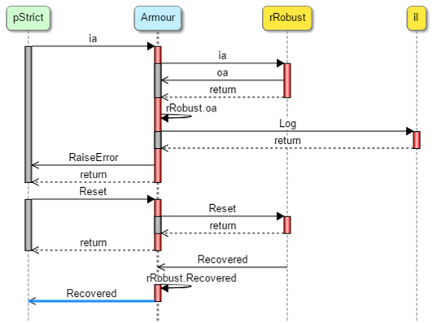
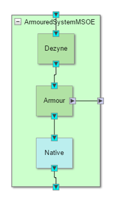
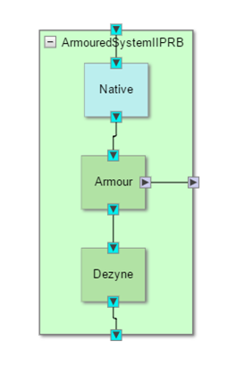

# Armouring patterns

An Armour protects a system built in Dezyne during runtime against interface violations by native code. Between Dezyne components such violations can never occur after passing the verification. The integration with native code cannot be formally verified and hence the native code could be misbehaving. Typically if the native code is not fully understood it may be suspected of not being fully interface compliant.

An Armour component shields the Dezyne system by capturing misbehavior and ensuring that the Dezyne components only perceive good behaviour. We call the interface between the Armour and the Dezyne component the Strict interface. We call the interface between the armour and the Native code the Robust interface. The Robust interface does not enforce the restrictions of the Strict interface and so, in a sense, allows misbehaviour. Depending on the situation the Armour could simply correct the violations such that the Dezyne components never notice anything. The Armour could also raise an error condition which must be handled by the Dezyne components first before normal behaviour is continued.

The Armour examples provided with this document all come in two flavours representing the situation with and without error handling. In all cases the error is logged for diagnostics purposes. The list is exhaustive in the sense that for any single possible interface violation an example is provided. The list may appear surprisingly small but many problems are static in nature and are detected by the compiler. Off course in practice multiple violations to an interface may occur and then Armour patterns would need to be merged.

As an example of the situation without error handling look at the often used example of a device that is always switched on and off in alternation. The interface would specify that it is illegal to send an on-command if it is already on and similarly illegal to send an off -command if it is already off.  In the implementation there is not a real problem to accept an on-command if it already on so that is not the reason to be strict in the interface. However, if we want to verify whether this device is used in a proper alternating way then having these strict interfaces supports such a verification. In this situation an Armour would need to log the error situation but probably the system could simply continue to execute.

In more complex situations an Armour cannot solve a violation independently. Since the behaviour is unexpected by the Dezyne components appropriate handling is not available and a general error status needs to be raised in the Dezyne components.  Also the native component generating the erroneous event must be reset to a known situation. This means a generic pattern of error status handling must be present in the Dezyne components to be prepared for interaction with Armour components.

In the Armour patterns provided we assume that the Dezyne component directly communicating with the Armour takes full responsibility for this error handling and hides this completely for other components making use of the functionality. This may not be applicable in all situations and then the error should be passed on.  This is just one example how such error handling is situation dependent. This means that many different patterns of error handling are possible; in this document and the given examples we consistently apply the pattern described below.

## Pattern of error handling behaviour
If the Armour detects a violation it sends an event RaiseError to the Dezyne component. The Dezyne component must go to a controlled state and will eventually send a Reset event to the Native component (the Armour will pass this on). As a consequence the Native component will go to a known state. The Native component is expected to send an output event Recovered as result. As a consequence the Armour and Dezyne components will move to normal mode of operation again.

Figure 1: example error handling sequence

The overall state behaviour related to this pattern is a state machine with 3 states: {noError, raisedError, resetError}. Often it will be possible to reduce this to 2 error states only. The Robust interface supports the same events as the Strict interface without its limitations.
The Armour maps the Robust interface to the Strict interface. It passes on all events in normal operation. It triggers on deviations of the allowed behaviour and then enters an error state. It logs the error using a Log interface via an injected port.  Also it raises the error with the Dezyne component and prevents any further regular interaction with the Native component until the error is handled as described above.

## Native component below required interface
This is the ‘natural’ way Native components are connected. A logging component connected through an injected port logs the error information. The variant with error handling is an extension of the variant without error handling and extends the Armour and Strict interface with the error handling state behaviour described above.  The Dezyne component and Robust interface error handling does only deal with 2 states, in error or not.

## Native component above provided interface
This may happen in special cases. The armouring concept is slightly more complex here.  On the other hand in the variant with error handling all components and interfaces only have a 2–state error handling mechanism, in error or not.  The Dezyne component needs the async feature to automatically send the asynchronous Reset event as a response to the RaiseError event. The Native component might send a Recovered event before it is being Reset. In that case the asynchronous Reset event will not be sent anymore by the clr of the async.

## Overview of Armouring patterns
This is the exhaustive list of Armour patterns separated in armouring either a provides interface or a requires interface. They all come in 2 flavours, with or without error handling.
### In Provides interface:
* ArmourIIPRV (IllegalInProvidesReturnsVoid): In-event not allowed by port -> an in-event with void return value is defined as illegal in the interface
* ArmourIIPRB (IllegalInProvidesReturnsBool): In-event not allowed by port -> an in-event with bool return value is defined as illegal in the interface
*	ArmourIIPRE (IllegalInProvidesReturnsEnum): In-event not allowed by port -> an in-event with enum return value is defined as illegal in the interface (very similar to bool case)
### In Requires interface:
*	ArmourOENABP (OutEventNotAllowedByPort): Event not allowed -> context should not generate an asynchronous out-event via requires interface
*	ArmourISOE (IllegalSynchronousOutEvent): Illegal -> context should not generate a synchronous out-event via requires interface
*	ArmourMSOE (MissingSynchronousOutEvent): Missing event -> context is expected to generate a synchronous out-event via requires interface
*	ArmourMSOE (MissingAsynchronousOutEvent): Missing event -> after a timeout period the armour can supplement the missing asynchronous out-event
*	ArmourREIR (RangeErrorInRequiresReply): Reply value not allowed by port -> the reply of a requires interface event could have a range error (a mis-mapping between two subints)
*	ArmourIBVIRR (Illegal Boolean value in Requires reply): Reply value not allowed by port -> a reply value from a required interface can contain a boolean value that is not allowed
### Might be expected but not possible Armour cases:
*	Range error in function parameter in/out-event => events cannot have control parameters
*	Missing in-event => occurrence of an in-event cannot be enforced
*	Reply value conflicts in out-events => out-events can only return void
