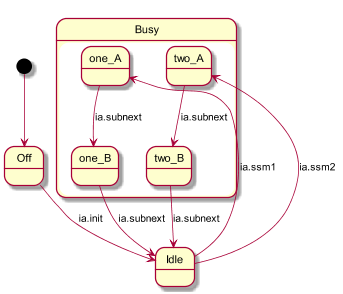

# Sub State Machine pattern

A Sub State Machine (SSM) is a means to encapsulate part of the behaviour inside a component.
Currently in Dezyne there is no syntax support for SSMs so the encapsulation is only for easier understanding.

## This example shows following features:
* an event arrives in the high level state machine and is forwarded to a SSM. 
Some processing might take place in the high level state machine and then be continued in the SSM before control is passed back
* an exit of the SSM is captured in the high level state machine which might do some postprocessing
* the requires port IResource is shared by both sub state machines
* by default the SSM retains the value of the state variable between activations (deep history). 
In the example the SSM state variable is initialized back to its 'Idle' state on exit (shallow history).
In other words the designer has full control over the choice for deep/shallow state behaviour.
* result values could be passed from a SSM to a higher level state machine by means of local variables or dedicated output events could be used

## Due to the fact there is no explicit syntax this example also shows some limitations:
* we would like to add scoping to the variables but currently everything can only be global within the component.
For the result value passing we make use of this.
* we would like to put the code for the SSM in separate blocks (or even separate files) but currently everything has to be
within the behaviour block of the component. We have put it in separate code blocks protected by the appropriate guards.

## Event forwarding

This is implemented by adding a special requires port (IReflector) to the component that on every event does a synchronous call-back. This construction is also referred to as reflector pattern.
The forward raises an event and the call-back is stored in the output event queue of the component.
It will be processed once the full statement block that contained the forward has been executed.
The call back will be captured in the SSM and will e.g. be mapped on a dedicated "on entry" event.
As a result an event to the high level state machine results in some actions at high level state machine level and
subsequently some actions at SSM level before control is passed back

The exit works similarly but then everything mirrored.

## Details on the example

Below diagram shows depicts this example with high level states 'Off', 'Idle', 'Busy' and substates 'one_A', 'one_B' for SSM1 and 'two_A', 'two_B' for SSM2.
In the corresponding DZN file the SSM state variable (with values 'Idle", 'A', 'B') is reused between the two SSMs since they are not active in parallel. The sub state machines are only active in the 'Busy' state of the superstate machine hence the corresponding guard statement.

The super state machine can be initialized to its Idle state and is then receptive to commands to start either of its submachines. The input event 'ssm1' kicks of sub state machine1 and brings the super state machine to its Busy state; similarly does event 'ssm2'. The sub state machine does an action on the shared Resource. After the Resource responds with 'done' it moves to a next state and does another action on the Resource. Since both sub state machines have only 2 steps/states they reach their end after another 'done' from the Resource. At the end a substatemachine executes an 'exit' which is forwarded to the super state machine. As a result the super state machine does a transition to 'Idle'.

An UML like diagram would look like this. Notice that the Reflector port is only an implementation detail and not relevant in the design of the state machine hierarchy.

## Waferhandler example
This 2nd example shows how shared resources can be handled in substatemachines. The parts belonging to the substatemachines are identified by prefixes
